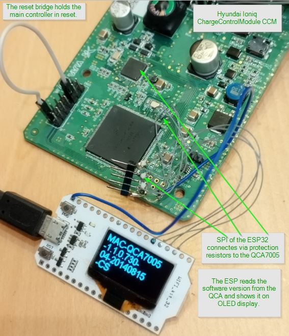
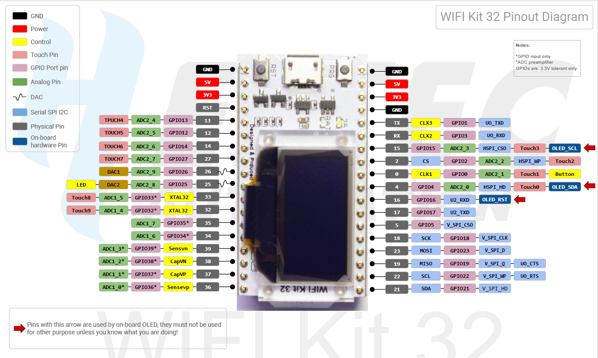
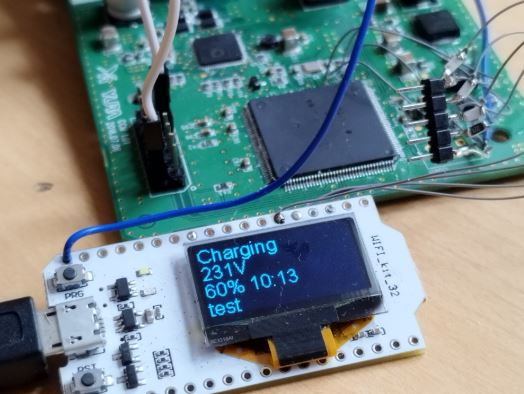

# ccs32berta

ESP32 arduino sketch talks with QCA7005 homeplug modem

## News / Change History / Functional Status

### 2023-07-04 Charging loop reached

After integration of the pev state machine and exi decoder based on the ccs32 project, the ccs32berta runs into the charging loop,
and shows the charging progress on the OLED. The test setup is pyPlc as EVSE, and the QCA7005 on the Ioniq CCM. At the moment
the software only uses "pure" SPI communication without using the interrupt-line, also not caring for configuring and confirming
of interrupt sources in the QCA. For the given use case, this should be sufficient, because there is no need to react on incoming
traffic faster than in the 30ms loop.

[2023-07-04_demoChargingWorks.log](doc/2023-07-04_demoChargingWorks.log)

## Todos
- [ ] Implement TCP retry to compensate for single lost packets
- [ ] Takeover latest state machine updates from pyPLC

## Cross References

* The Hyundai Ioniq/Kona Charge Control Module (CCM): https://github.com/uhi22/Ioniq28Investigations/tree/main/CCM_ChargeControlModule_PLC_CCS
* The ccs32 "reference project" (which uses ethernet instead of SPI): https://github.com/uhi22/ccs32
* pyPLC as test environment: https://github.com/uhi22/pyPLC
* Discussion on openinverter forum: https://openinverter.org/forum/viewtopic.php?t=3727
* Similar project discussed on SmartEVSE github: https://github.com/SmartEVSE/SmartEVSE-3/issues/25#issuecomment-1608227152
